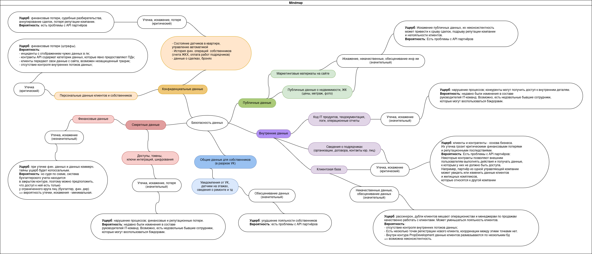
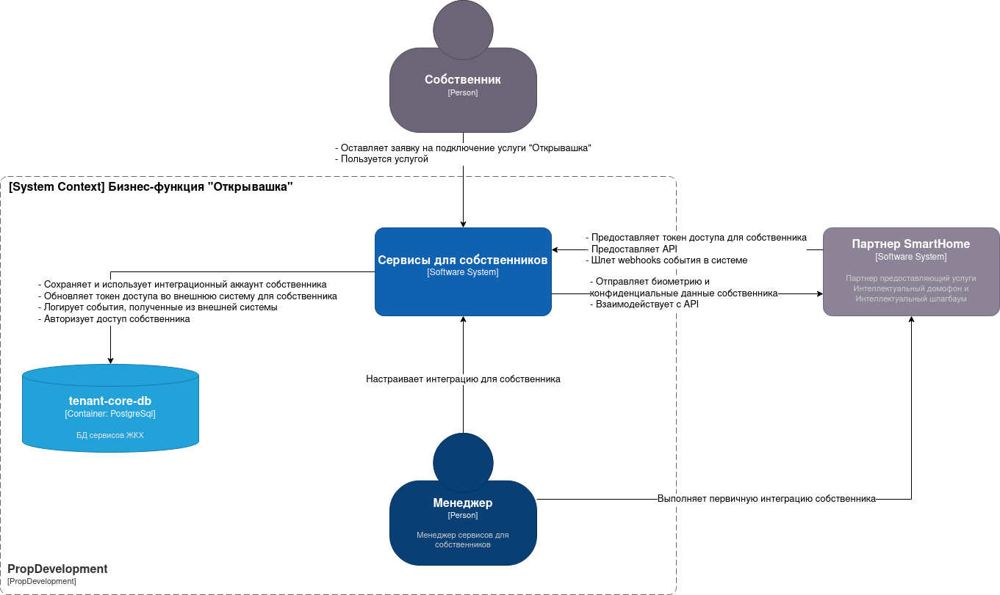
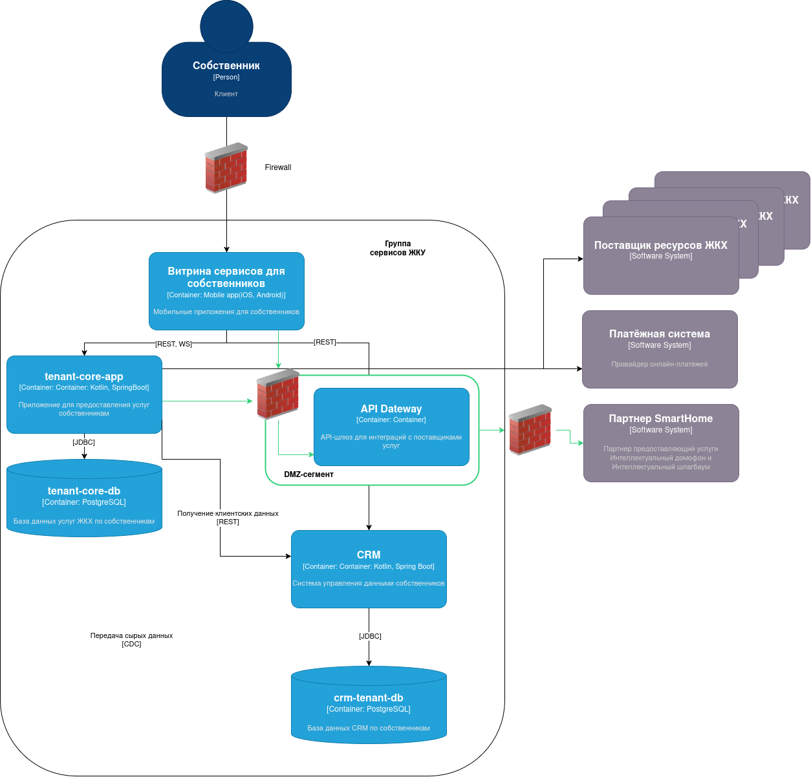

# Комплексный аудит безопасности IT-продуктов строительной компании PropDevelopment

## Задание 1. Разработка проверочного листа по безопасности данных



## Задание 2. Разработка и заполнение проверочного листа для бизнес-систем

[Проверочный лист](Task_2/IB.md)

## Задание 3. Внешние интеграции

### Диаграмма контекста для новых функций "Умный дом"


### Часть диаграммы контейнеров для новых функций "Умный дом"


### Сформируйте список требований, которые должны удовлетворить внешние интеграции. 
#### Описание процесса взаимодействия с платформой "Умный дом"
##### Порядок предоставления бизнес-функции собственнику:
- Чтобы получить доступ к функциям "Интеллектуальный домофон", "Интеллектуальный шлагбаум" собственник оставляет заявку в мобильном приложении.
- Менеджер PropDevelopment через административный интерфейс производит первичную интеграцию собственника с внешней платформой.
- В результате во внутреннем хранилище tenant-core-db появляется запись с access_token внешней платформы для дальнейших операций от лица этого собственника.
- Дальнейший доступ к разделу собственника осуществляется после многофакторной аутентификации в мобильном приложении (пароль + биометрия устройства, например).
- Собственник может управлять объектами в соответствии с его правом собственности\договором аренды.

##### Функционал нового раздела "Открывашка":
- принять сигнал и видео с внешнего домофона; 
- открыть дверь;
- добавить\удалить лицо в список для автоматического открытия двери;
- открыть шлагбаум;
- добавить\удалить номер транспортного средства для автоматического открытия шлагбаума;
- просмотр камер на двери, на шлагбауме;
- посмотреть историю своих входов\въездов.

#### Классификация новых данных:
- биометрические данные (шаблоны лиц) - Секретные;
- номера ТС, журналы событий (история входов\въездов), видеопотоки - Конфиденциальные.

Предполагается хранение на стороне партнера: 
- шаблоны лиц, номера ТС с привязкой к объекту - для распознавания;
- видеопотоки с оборудования;
- журналы событий.

Предполагается передача от партнерской системы в PropDevelopment (и на устройство собственника):
- список настроенных доступов к объектам (без биометрии, номера ТС с маской);
- видеопотоки;
- события в обезличенном виде для мониторинга инцидентов стороной PropDevelopment. 

#### Требования безопасности к внешней интеграции:
1. Передача всех данных между системами должна использовать сквозное шифрование (TLS).
2. Данные клиентов (ПДн) между системами должны передаваться в обезличенном виде.
3. Взаимодействие с системами-партнерами осуществляется через единый API-шлюз в выделенном изолированном DMZ-сегменте.
Предполагается реализация API Gateway под бизнес-функцию "Открывашка" с перспективой дальнейшего перевода на шлюз других интеграций.
4. API Gateway выполняет функции: rate limiting, аутентификация входящего трафика, кэширование, аудит, мониторинг.
5. Все вызовы к внешнему API должны логироваться в SIEM PropDevelopment с полным контекстом для расследования инцидентов.
6. Все события в системе должны передаваться партнером в централизованную систему мониторинга PropDevelopment.
7. Должны быть настроены алерты на подозрительную активность пользователя: множественные неудачные попытки открытия, попытки доступа к неавторизованным объектам и тд.

#### Требования к внешней системе:
1. Система партнера должна находиться в юрисдикции РФ; должна соответствовать 152-ФЗ.
2. Биометрические данные должны храниться у партнера исключительно в зашифрованном виде (AES-256).
3. Партнер должен предоставить спецификации OpenAPI.
4. Протокол взаимодействия: REST API для управления; WebSocket или Server-Sent Events для входящих событий (звонок в домофон).
4. Требование доступности к внешней системе: доступность внешнего API - не менее 99%; Максимальное время отклика на команду 2 секунды.
5. Поставщик должен поддерживать отправку событий (webhooks) на защищённый эндпоинт API Gateway PropDevelopment.
6. Система поставщика услуги должна предоставлять физические инструменты доступа на территорию в случае недоступности онлайн-функций.

#### Требования к аутентификации и авторизаци:
1. Доступ к разделу собственника осуществляется после многофакторной аутентификации в мобильном приложении (OIDC, пароль + биометрия устройства, например).
2. PropDevelopment должна проверять права Собственника на управление конкретным устройством в конкретном ЖК.
3. Для вызовов API партнера использовать протокол аутентификации OAuth 2.0.
4. Разработать механизм аутентификации входящих запросов от партнерских систем.
5. Критические операции в разделе "Открывашка", например, изменение списков доступа - должны подтверждаться дополнительным действием (ввод пин-кода\ кода из email, например).

## Задание 4. Защита доступа к кластеру Kubernetes

[RBAC](Task_4/RBAC.md)

```bash
cd Task_4/
./create-namespaces.sh
```

```bash
cd Task_4/
./create-users.sh
```

```bash
cd Task_4/
./create-roles.sh
```

```bash
cd Task_4/
./create-role-bindings.sh
```

Тестирование:
```bash
cd Task_4/
./test-access.sh
```

Для очистки выполнить
```bash
cd Task_4/
./cleanup-all.sh
```